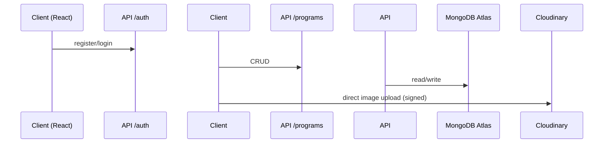

# FitVerse – Project Planning

## Live Demo

[https://fit-verse-bay.vercel.app/](https://fit-verse-bay.vercel.app/)

---

## 1. Vision & Product Overview

FitVerse is a holistic fitness‑and‑wellness platform that unites certified **fitness trainers, nutritionists, and yoga instructors** with clients seeking personalized guidance. The core idea is to provide a single ecosystem where professionals can market themselves while users discover, book, and collaborate with experts.

---

## 2. Personas

| #   | Persona                                  | Goals                                                            | Pain‑Points                                                    | How FitVerse Helps                                                           |
| --- | ---------------------------------------- | ---------------------------------------------------------------- | -------------------------------------------------------------- | ---------------------------------------------------------------------------- |
| 1   | **Natalie – Busy Professional (Client)** | Integrate quick workouts & healthy meals into a hectic schedule. | Information overload, time scarcity, low accountability.       | Curated expert matching, wearable integration, quick chat & progress nudges. |
| 2   | **Ethan – Fitness Newcomer (Client)**    | Lose weight and build foundational strength on a budget.         | Intimidated by gyms, unsure what to eat, afraid of fads.       | Beginner‑friendly programs, gamified streaks, low‑cost group challenges.     |
| 3   | **Lauren – Certified Trainer (Pro)**     | Expand online clientele and build a brand.                       | Reliance on social media, no integrated scheduling or billing. | LinkedIn‑style profile, program marketplace, analytics dashboard.            |
| 4   | **David – Licensed Nutritionist (Pro)**  | Deliver custom meal plans & collaborate with trainers.           | Scattered tools, difficulty showcasing credentials.            | HIPAA‑ready telehealth, verified badge, shared client workspace.             |

---

## 3. Benchmark Highlights

- **Trainerize / My PT Hub** – strong workout tracking, weak social feed.
- **Healthie** – dietitian‑centric telehealth, minimal fitness tools.
- **Mindbody** – excellent booking, no holistic collaboration.
- **Opportunity** – Combine **fitness + nutrition** services, robust social feed, AI‑driven personalization, and multi‑expert collaboration.

---

## 4. Functional Requirements (v1)

1. **User Registration & Login** – JWT‑secured auth for experts & clients.
2. **Expert Profile** – Display/edit photo, display name, bio, location, social links.
3. **Program CRUD** – Experts create, update, delete programs with duration, price, highlights, embedded FAQs.
4. **Availability Management** – Experts embed weekly time‑slots in profile; Calendly iFrame planned for booking.
5. **Client Discovery & Search** – Real‑time search by name, location, specialty.
6. **Reviews & Ratings** – Clients review experts & purchased programs.
7. **Secure Messaging** – One‑on‑one chat between client ↔ expert (road‑map).
8. **Responsive UI** – Mobile‑first Tailwind design, tested down to 360 px.

### Good‑to‑Have (Road‑map)

- Live‑stream classes, wearable integrations, in‑app payments, group challenges.

---

## 5. Non‑Functional Requirements

| Category            | Requirement                                                      |
| ------------------- | ---------------------------------------------------------------- |
| **Performance**     | <3 s avg page load, scalable to 10 k concurrent users.           |
| **Security**        | HTTPS, bcrypt password hashing, JWT auth, PCI‑compliant gateway. |
| **Availability**    | 99.9 % uptime – Vercel edge + multi‑zone MongoDB.                |
| **Maintainability** | Monorepo (Vite + Express) with ESLint, Prettier, CI tests.       |
| **Accessibility**   | WCAG 2.1 AA colour contrast & keyboard nav.                      |

---

## 6. System Design

### 6.1 Tech Stack

| Layer          | Technology                                                                                     |
| -------------- | ---------------------------------------------------------------------------------------------- |
| **Frontend**   | React 18 + TypeScript, Vite, Tailwind CSS, shadcn‑ui, lucide‑react, React Query, Framer Motion |
| **Backend**    | Node.js 18, Express 4, express‑validator, JWT, Cloudinary SDK                                  |
| **Database**   | MongoDB Atlas (Mongoose ODM)                                                                   |
| **Deployment** | Vercel – separate Frontend & Serverless functions                                              |
| **Dev Tools**  | Lovable AI, Roo Code, Amazon Q, ChatGPT, ESLint, Prettier                                      |

### 6.2 High‑Level Flow

### 6.3 Data Models

- **User** – personal info, hashed password, socialMedia, _embedded_ availability.
- **Program** – `expert` (ObjectId→User), description, duration, price, highlights, _embedded_ FAQs.

---

## 7. Core Use‑Cases

1. **Expert Sign‑Up** → create user → redirect to multi‑step profile wizard.
2. **Login Session** → store JWT → fetch `/api/users/:id` → open Expert Profile.
3. **Edit Field** → PATCH single field (bio/location etc.) → optimistic UI update.
4. **Create Program** → POST `/api/programs` → display in profile & marketplace.
5. **Set Availability** → PATCH `/api/users/availability` → Calendly sync (future).
6. **Search Expert** → GET `/api/users?query=` → filter & sort cards.

---

## 9. Future Road‑map

| Phase    | Feature                                                         |
| -------- | --------------------------------------------------------------- |
| **v1.1** | Stripe payments, client reviews, public feed posts.             |
| **v1.2** | Group challenges, gamification leaderboard, push notifications. |
| **v2.0** | React Native app, AI‑adaptive programs, live video classes.     |

---

## 10. Links & Assets

- **Live Site**: <https://fit-verse-bay.vercel.app/>
- **GitHub**: <https://github.com/rohanvarma29/fit-verse>
- **Architecture Diagram**: `/public/architecture.jpeg` (see repo)

---

_Planning document updated May 2025 via AI assistance._
